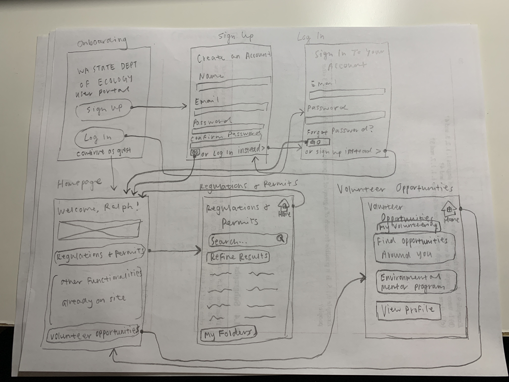
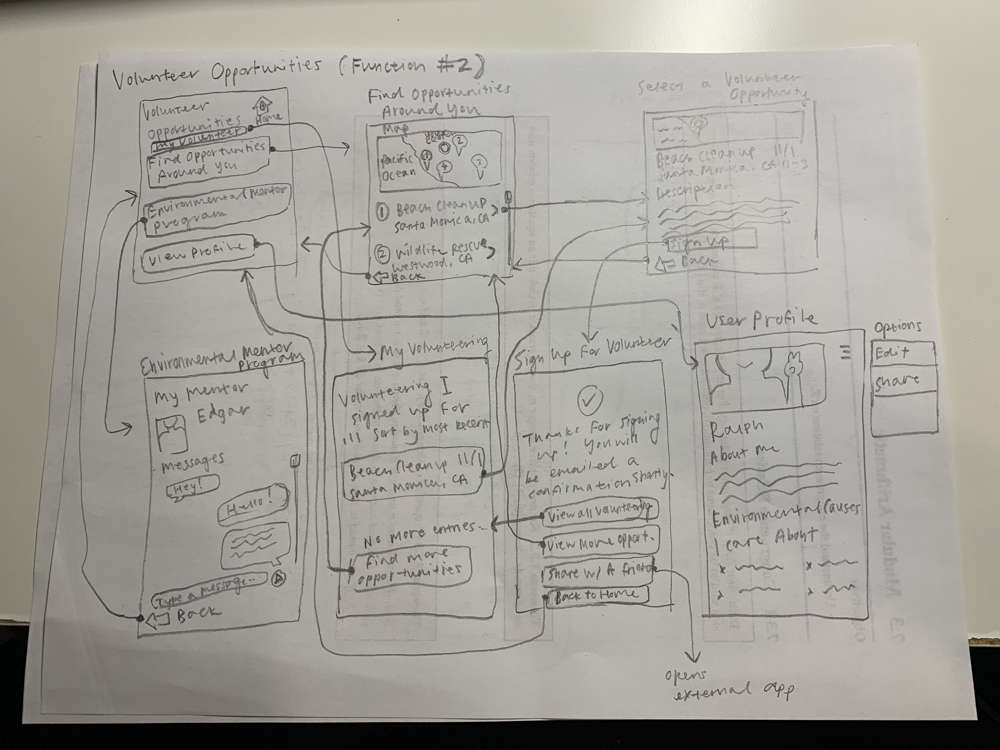
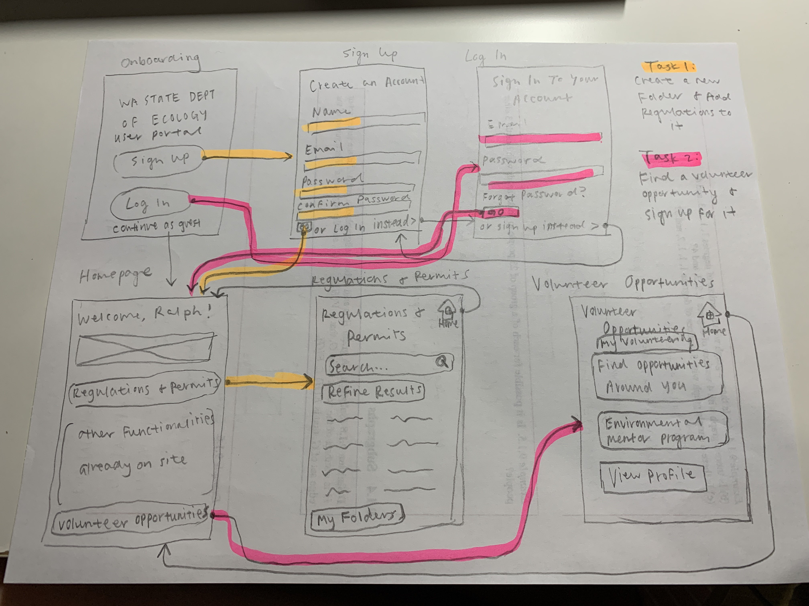
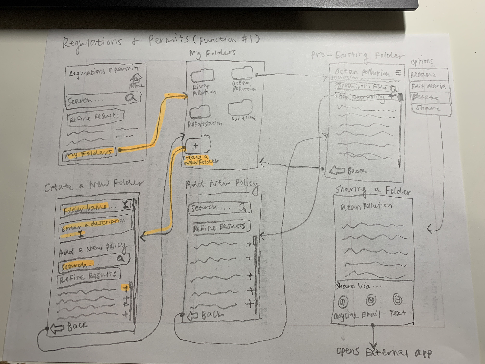
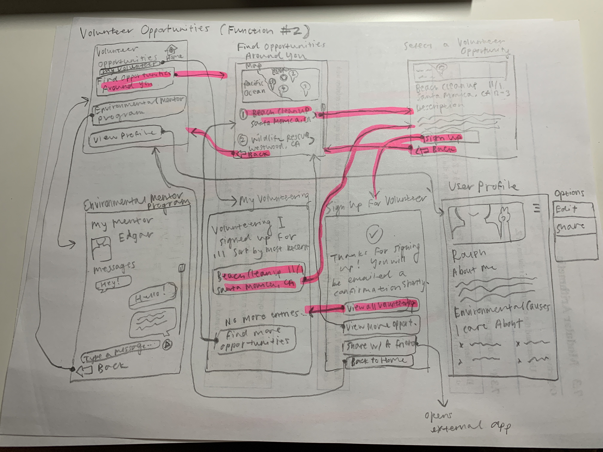

# Assignment 05: Low-Fidelity Prototypes
**Author:** Evelyn Hu  
**Course:** DH110 User Interface and Design  
**Description:** After creating personas and scenarios as a proposal to implement features to make the Washington State Department of Ecology website more accessible, I have now constructed low-fidelity prototypes that model the implementation of such features.

## The Purpose of Low-Fidelity Prototypes
UX storytelling is important in that designers can sometimes forget the fact that they're designing a product for *other people's* usage. When spending a long time tunnel visioning on designing their product to be the best it can be, they may lose sight of who the target audience is and what it is that they actually want from the product. Therefore, UX storytelling helps designers ground themselves by creating personas to better envision how the product should be designed to be the most relevant to the user's needs. Using personas for storytelling helps designers view their product from a different perspective and create a better and improved product.

## Tasks Supported
**1. Implementing a user portal to keep track of regulations & permits**  
As there are many regulations and permits (4109, to be exact) listed in the portal on the website, it may be difficult to keep track of all of these. Therefore, implementing a user-friendly portal where users can log in, save commonly referenced regulations and permits, be notified of any updates, and be able to easily share links with coworkers would be beneficial to users.  
**2. Improving the "What you can do to reduce greenhouse gases" page**  
As it is now, the "What you can do to reduce greenhouse gases" pages on the website is rather bare-bones and lacks functionality; it simply lists information that users would likely already know. In order to encourage users to make a greater effort, this page should be updated with new and relevant information, such as suggestions on where to volunteer, and opportunities for people to educate and be educated about sustainability. Climate change is not an issue that can be solved alone; therefore, creating a sense of community would be useful in encouraging users to act in prevention of climate change.

## Low-Fidelity Prototypes
  
  
  

## Prototype Testing
### Task: Creating an account to access the features/logging in to access features
  
### Task: Create a new folder and add policies/regulations to it
  
### Task: Find a volunteer opportunity and sign up for it
  

## Reflection
