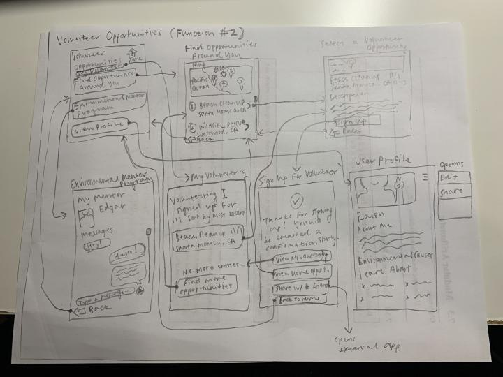

# Assignment 05: Low-Fidelity Prototypes
**Author:** Evelyn Hu  
**Course:** DH110 User Interface and Design  
**Description:** After creating personas and scenarios as a proposal to implement features to make the Washington State Department of Ecology website more accessible, I have now constructed low-fidelity prototypes that model the implementation of such features.

## The Purpose of Low-Fidelity Prototypes
Low-fidelity prototypes are an important tool in user design, as they allow designers to test their designs on potential users and envision any problems that may occur before publishing the real product. Designers are able to see if users will use their product as it was intended to be used, detect major problems with the design of their product, gauge user satisfaction, and more. By using low-fidelity prototypes, designers can edit their idea before spending a lot of time designing a product that may not suit the user's needs.

## Tasks Supported
**1. Creating a user portal to keep track of regulations & permits**  
Users will be able to create an account to keep track of regulations and permits that they may have to access often. Users can create folders and add any rule or regulation that they wish to a folder, so that they are able to stay organized when referencing the documents. Users can also share their folders with other colleagues for convenience.   
**2. Finding volunteer opportunities easily through a volunteer portal**  
Users will be able to find volunteer opportunities around them for convenience's sake, sign up for volunteering directly on the app, and view all volunteer appointments they have made. Users can also message an "Environmental Mentor" directly in the app with questions regarding the environment or just to chat.  

## Low-Fidelity Prototypes
  
  
  

## Prototype Testing
#### Task: Creating an account to access the features/logging in to access features
  
#### Task: Create a new folder and add policies/regulations to it
  
#### Task: Find a volunteer opportunity and sign up for it
  

## Reflection
### What went well:
- Task 1: Participant was able to create account with ease, find the permits & regulations portal, create a new folder, and add documents to the folder with ease.
- Task 2: Participant took a bit longer to go through the wireframes, but was ultimately able to complete the task with relative ease.
### What went wrong:
- Task 1: This task went well for the most part; not many functions needed to be used, so I should have given the participant a more thorough task to do.
- Task 2: Some frames were missing "back" buttons, making the participant need to backtrack to multiple frames needlessly. Participant expressed desire to be able to refine volunteering opportunity results, as well as see dates before opening the information for a given opportunity. Participant was confused by the many flow arrows here.

### Potential improvements:
- Create more thorough scenarios to ensure user uses all designed functions. The participant did not end up going through all screens designed.
- Ensure that users have a way to escape/go back on all screens (missed some screens where there were no back buttons). For the second task, the user had to go through many screens before being able to make their way back to the home page; this made me realize that "back" buttons are not the most efficient, and "home" buttons should also be available.
- Flow arrows were confusing to the user. Next time, I will make the arrows clearer to communicate the flow more efficiently. This also tied back to the previous problem, where "back" buttons created multiple arrows and the flow of getting back to the homepage was not clear to the user.
